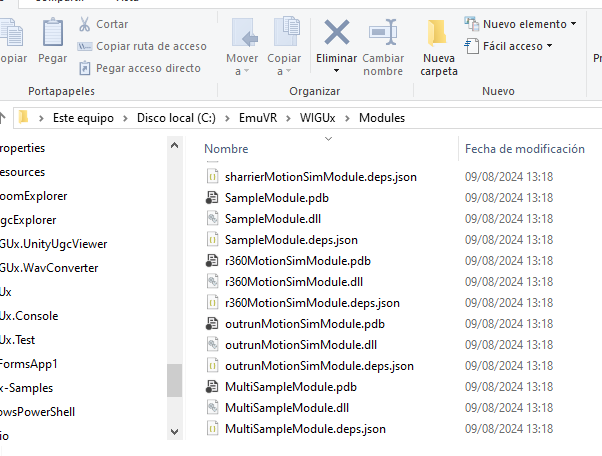
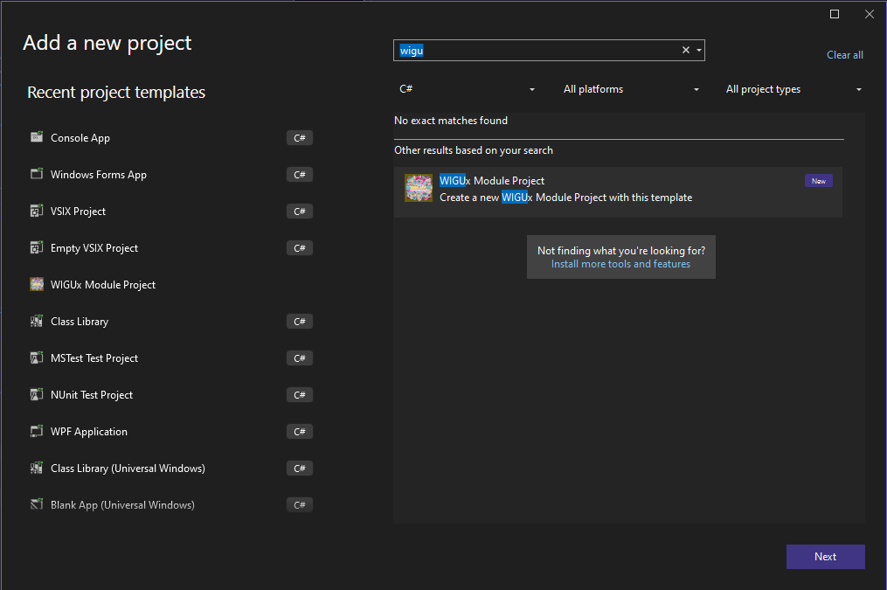

# WIGUx Samples

Module examples to use with WIGUx

## Cloning the Repository

Follow these steps to clone the repository and initialize the submodules:

1. **Clone the repository**:

   Open a terminal or command prompt and run the following command to clone the repository:

   ```bash
   git clone https://github.com/WIGUx/WIGUx-Samples.git
   ```

## Requisites

- **Visual Studio 2022**: Ensure that Visual Studio is installed before proceeding. You can download it from [Visual Studio](https://visualstudio.microsoft.com/).
- Install vs.templates: Open a terminal in WIGUx Samples repository and execute **./install-templates.bat**

## Build

1. Open WIGUx.Samples.sln file using Visual Studio 2022
2. Open UGC.targets file and modify your EmuVR folder path


4. Build the solution (F6) or the desired project(SHIFT+F6) and ensure you get a successful build.
5. Once build is finished it will generate automatically your dll in EMUvr\WIGUx\Modules ready to go.



## Create your own Module

1. Open WIGUx.Samples.sln file using Visual Studio 2022
2. In Solution Explorer panel, select your solution and right click in Add/New Project
3. In New Project Dialog search "WIGUx Module Project" and click Next button



5. Modify the project name to a desired one and click Create
6. This will generate a project with 2 files a Module and Controller example files.
7. Select your project, right click and Build the project (SHIFT+F6)
8. Once build is finished it will generate automatically your dll in EMUvr\WIGUx\Modules ready to go.

## Associate a Controller with a UGC

Now your modules are in the expected folder but you need associate the UGC with the Controller you created

1. Open EmuVR\WIGUx\Content Manager\WIGUx.Manager.exe
2. In the Toolbar click Configuration button
3. Now from a Explorer drag your UGC file into the UGC list in Modules section
4. Select your UGC and click 'Add module to UGC' button and select the Controller created
5. Click save and we are ready to go!

## Upate in your code

Now we have everything configured, if we want to update our module/controller code with new functionality we only need to build the project, this will override automatially the old assembly in EMUVR and next step will be launch emuvr for testing


