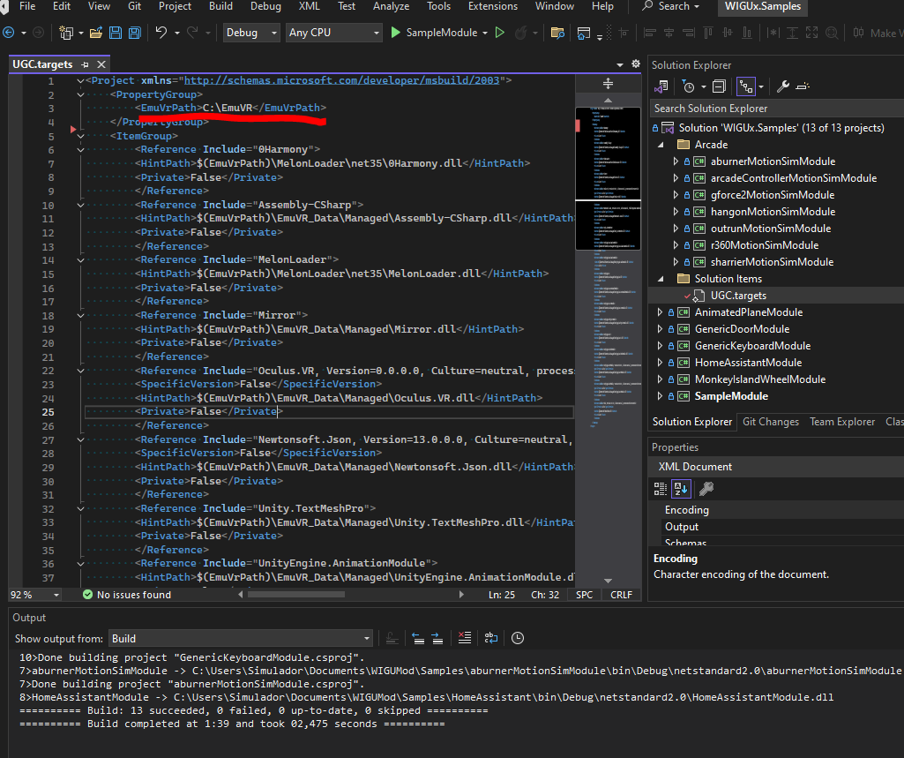

# WIGUx Samples

Module examples to use with WIGUx

## Cloning the Repository

Follow these steps to clone the repository and initialize the submodules:

1. **Clone the repository**:

   Open a terminal or command prompt and run the following command to clone the repository:

   ```bash
   git clone https://github.com/WIGUx/WIGUx-Samples.git
   ```

## Requisites

- **Visual Studio 2022**: Ensure that Visual Studio is installed before proceeding. You can download it from [Visual Studio](https://visualstudio.microsoft.com/).
- Install vs.templates: Open a terminal in WIGUx Samples repository and execute **./install-templates.bat**

## Build

1. Open WIGUx.Samples.sln file using Visual Studio 2022
2. Open UGC.targets file and modify your EmuVR folder path



4. Build the solution (F6) or the desired project(SHIFT+F6) and ensure you get a successful build.
5. Once build is finished it will generate automatically your dll in EMUvr\WIGUx\Modules ready to go.


## Create your own Module

1. Open WIGUx.Samples.sln file using Visual Studio 2022
2. In Solution Explorer panel, select your solution and right click in Add/New Project
3. In New Project Dialog search "WIGUx Module Project" and click Next button
4. Modify the project name to a desired one and click Create
5. This will generate a project with 2 files a Module and Controller example files.
6. Select your project, right click and Build the project (SHIFT+F6)
7. Once build is finished it will generate automatically your dll in EMUvr\WIGUx\Modules ready to go.


